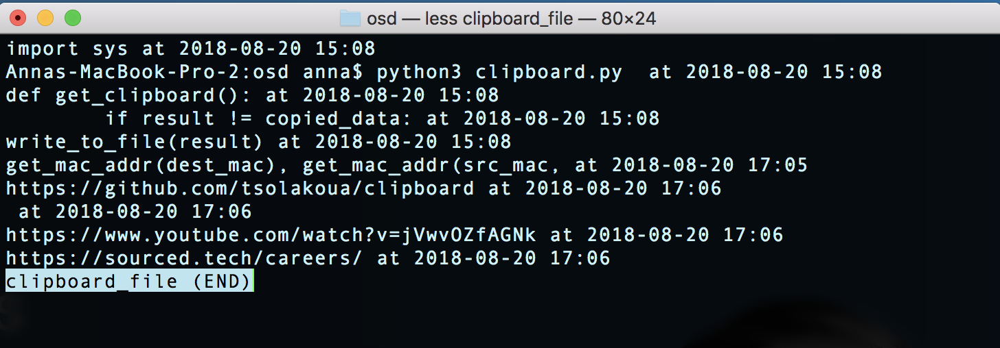

## clipboard

This tool appends user copied data and datetime to a file. It is compatible with MacOS and hasn't been tested yet to another OS. 

### Run in the command line

``` 
$ python3 clipboard.py
```

### View Results

Below you can see the file containing copied data.



